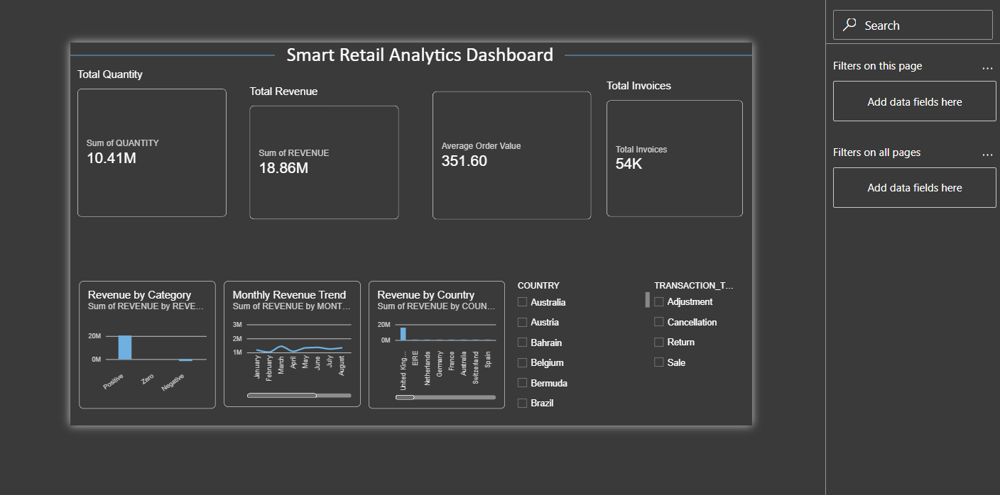

\# Smart Retail Data Quality \& Intelligence Platform


An end-to-end retail data engineering and analytics project focused on data quality, business analysis, data warehousing and business intelligence.


\## Project Overview


This project processes the UCI Online Retail II dataset through data profiling, cleaning, validation, transformation and business analysis.


The processed data is loaded into Snowflake for storage and SQL analysis, and Power BI is used to build an interactive business dashboard.


\## Business Problem


Retail transaction data can contain duplicate records, missing customer information, cancelled transactions, returns, unusual prices and other data-quality issues.


The goal of this project is to improve data reliability and make the data suitable for analytical reporting and business decision-making.


\## Project Workflow


Raw Dataset  

↓  

Data Profiling  

↓  

Data Cleaning \& Validation  

↓  

Feature Engineering  

↓  

SQL Business Analysis  

↓  

Hadoop / HDFS  

↓  

Snowflake  

↓  

Power BI Dashboard


\## Technology Stack


\- Python

\- Pandas

\- Pydantic

\- SQL

\- Hadoop / HDFS

\- Snowflake

\- Power BI

\- Git

\- GitHub


\## Dataset


\### Dataset Source


This project uses the **Online Retail II** dataset from the **UCI Machine Learning Repository**.

Source:  
https://archive.ics.uci.edu/dataset/502/online+retail+ii

Creator: Daqing Chen

Citation:  
Chen, D. (2012). Online Retail II [Dataset].  
UCI Machine Learning Repository.

DOI: https://doi.org/10.24432/C5CG6D

License: CC BY 4.0 


\### Dataset Details


\- Raw Records: 1,067,371

\- Final Records: 1,033,036

\- Final Columns: 24

\- Products: 5,305

\- Customers: 5,942

\- Countries: 43


\## Data Quality Work


The dataset was analysed for:


\- Missing values

\- Duplicate records

\- Negative quantities

\- Cancelled transactions

\- Returns

\- Zero-price records

\- Negative-price records

\- Date validity

\- Data types


Exact duplicate records were removed, missing descriptions were handled using StockCode-based mapping, and missing Customer IDs were retained using a separate flag.


\## Data Transformation


The analysis-ready dataset contains derived fields including:


\- Invoice\_Date

\- Year

\- Month

\- Month\_Name

\- Transaction\_Type

\- Customer\_Type

\- Revenue

\- Revenue\_Category

\- Quantity\_Category

\- StockCode\_Type

\- Customer\_ID\_Missing


Revenue was calculated using:


`Revenue = Quantity × Price`


\## SQL Analysis


SQL was used for:


\- Customer revenue analysis

\- Top customer analysis

\- Repeat customer analysis

\- Customer purchase gap analysis

\- Customer ranking

\- Customer segmentation

\- Product analysis

\- Monthly revenue analysis

\- Month-over-month revenue analysis

\- Transaction analysis

\- Cancellation analysis

\- Running revenue and revenue contribution


Advanced SQL concepts used include:


`GROUP BY`, `HAVING`, `CASE WHEN`, `CTE`, `JOIN`, `Subquery`, `LAG()`, `RANK()`, Window Functions, Date Functions and Aggregations.


\## Snowflake


Snowflake was used as the cloud data warehouse for the processed retail dataset.


The implementation included:


\- Database

\- Schema

\- Warehouse

\- CSV File Format

\- Internal Stage

\- PUT

\- GZIP Compression

\- COPY INTO

\- Data Validation

\- SQL Analysis


A total of \*\*1,033,036 records\*\* were successfully loaded into the Snowflake table.


\## Hadoop / HDFS


Hadoop / HDFS was used at a basic distributed-storage and project-integration level.


The work included Hadoop environment access, HDFS directory and file operations, and preparing retail data for downstream processing.


\## Power BI


The processed retail data was connected from Snowflake to Power BI.


\### KPI Cards


\- Total Revenue: 18.86M

\- Total Quantity: 10.41M

\- Average Order Value: 351.60

\- Total Invoices: 54K


\### Visualizations


\- Revenue by Category

\- Monthly Revenue Trend

\- Revenue by Country


\### Interactive Filters


\- Country

\- Transaction Type


\### DAX Measures


\- Total Revenue

\- Total Quantity

\- Total Invoices

\- Average Order Value


## Dashboard Preview




## Author

**Umesh Ghadge**

Personal data engineering and analytics portfolio project.


## Repository Structure


```text

Smart\_Retail\_Data\_Quality\_Intelligence\_Platform/

│

├── Data/

│   ├── raw/

│   └── processed/

│

├── Python/

│   ├── inspect\_data.py

│   └── clean\_data.py

│

├── SQL/

│   └── retail\_analysis.sql

│

├── Snowflake/

│   └── snowflake\_setup.sql

│

├── Hadoop/

│   └── hadoop\_notes.md

│

├── Power bi/

│   └── Smart\_Retail_Analytics.pbix

│

├── Documents/

│   ├── project_summary.md

│   └── dashboard_preview.png


├── README.md

└── .gitignore

```


## Project Outcome


The project produced a cleaned and analysis-ready retail dataset, performed SQL-based business analysis, implemented Snowflake data warehousing, and delivered an interactive Power BI dashboard.

